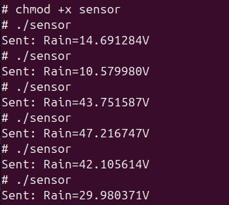

#  Projeto de Programação Aplicada – Monitoramento Inteligente de Carga

##  Descrição Geral
Este projeto tem como objetivo o **monitoramento inteligente de cargas sensíveis**, desenvolvido no contexto do Instituto Militar de Engenharia (IME).  
Nosso grupo foi responsável pela integração do **Módulo Sensor de Chuva (SS29)** ao kit de desenvolvimento **STM32MP1-DK1**, de modo a detectar **infiltração de líquidos e exposição a ambientes úmidos**, que podem comprometer a integridade da carga durante o transporte.

O sistema embarcado coleta dados do sensor, processa-os e transmite em **tempo real via protocolo UDP** para um **servidor central**, permitindo acompanhamento remoto. Além disso, foi desenvolvida uma **interface gráfica de monitoramento** no PC, que exibe os valores atuais, histórico recente e alertas visuais.

---

##  Requisitos

1) **Compilação**

É necessária uma **toolchain ARM** para compilação cruzada:
```
arm-linux-gnueabihf-g++
```

2) **Documentação**

- **Doxygen** para geração de documentação técnica.  
- **Graphviz** para criação automática de diagramas UML e de dependência.

---

##  Organização do Código

O núcleo do projeto é a classe **`RainSensor`**, que abstrai o funcionamento do **sensor de chuva SS29** e fornece métodos simples para leitura e interpretação dos dados.  
Essa estrutura modular facilita a manutenção e permite a integração com outros módulos do sistema embarcado (como sensores de temperatura ou umidade).

---

Aqui está a **estrutura da classe** baseada no código `RainSensorv2.cpp`, seguindo o mesmo modelo de descrição usado no README anexo.
Você pode **copiar e colar diretamente no seu README**:

---

### **Estrutura da Classe**

Atributos:

* `std::string adc_path`: caminho do canal ADC no sistema Linux embarcado (ex: `/sys/bus/iio/devices/iio:device0/in_voltage13_raw`).
* `std::string dest_ip`: endereço IP do servidor remoto para envio UDP.
* `int dest_port`: número da porta UDP de destino.
* `int max_envios`: quantidade máxima de transmissões.
* `int intervalo_seg`: intervalo entre cada envio (em segundos).

Funções principais:

`int lerSensor()`
Lê o valor bruto do ADC (inteiro entre 0 e 4096) a partir do arquivo indicado em `adc_path`.
Retorna o valor lido.

`float converterTensao(int valor_adc)`
Converte a leitura do ADC em tensão (em volts) usando a relação:

```
tensão = (3.3 * valor_adc) / 4096
```

Retorna o valor convertido.

`std::string gerarMensagem(float tensao)`
Formata a mensagem a ser enviada via UDP no padrão:

```
"Rain=<tensão>V"
```

`bool enviarUDP(const std::string& mensagem)`
Cria o socket UDP e envia a string formatada para o IP e porta definidos.
Retorna `true` em caso de sucesso, `false` se ocorrer falha no envio.

`void executar()`
Executa o loop principal de leitura e envio:

1. Lê o valor do ADC.
2. Converte para tensão.
3. Gera a mensagem.
4. Envia via UDP.
5. Aguarda `intervalo_seg` segundos entre os envios.

`int main()`
Instancia a classe `RainSensor`, inicializa os parâmetros e chama o método `executar()`.

---

##  Estrutura do Projeto

```
📂 Sensor-de-chuva
 ├── 📂 src
 │    ├── Leitor.cpp      # Classe de leitura e envio do sensor
 │
 ├── 📂 docs
 │    ├── Doxyfile             # Configuração Doxygen
 │    └── 📂 html             # Documentação gerada
 │
 │
 ├── 📂 bin
 │    └── programa             # Executável funcional do sensor de chuva
 │
 ├── README.md                 # Este arquivo
 └── Makefile                  # Script de compilação cruzada
```

---

##  Sensor Escolhido – **Módulo de Chuva (SS29)**
- **Tipo:** Analógico/Digital  
- **Alimentação:** 3.3V (⚠️ nunca usar 5V com STM32MP1-DK1)  
- **Sinal Analógico:** Indica nível de umidade (0–4095 no ADC de 12 bits).  
- **Saída Digital (opcional):** Indica se o nível ultrapassou um limiar definido no módulo.  

###  Funcionamento:
- Em ambiente seco → valores baixos no ADC.  
- Em contato com umidade/chuva → valores altos no ADC.  
- Permite detectar infiltrações ou ambientes inadequados para transporte da carga.  

---

##  Compilação e Execução

###  Compilação Cruzada
1. Instalar a toolchain na VM Linux:
   ```bash
   tar -xvf arm-buildroot-linux-gnueabihf_sdk-DK2.tar.gz
   ```
2. Compilar o código:
   ```bash
   source /path/to/toolchain/environment-setup
   make
   ```

###  Execução no Kit
1. Transferir o executável:
   ```bash
   scp bin/sensor_chuva root@192.168.42.2:/home/root
   ```
2. Conectar via SSH:
   ```bash
   ssh root@192.168.42.2
   ```
3. Acessar o diretório:
   ```bash
   cd ./projeto_rain_sensor
   ```
4. No terminal da placa:
  ```bash
   chmod +x sensor
   ./sensor
   ```
5. O programa exibirá a tensão medida:
    ```bash
   Exemplo de saída
     Sent: Rain=9.590625V
     Sent: Rain=7.089038V
     Sent: Rain=8.450700V
    
   ```    
### **Exemplo de execução**
O programa executado corretamente vai resultar no valor da voltagem convertida de ADC.


   

---

##  Programa Funcional no Kit

O repositório já contém um **executável compilado** chamado `programa`, localizado na pasta `bin/`.  
Este executável realiza a **leitura do Módulo de Chuva (SS29)** diretamente no kit de desenvolvimento **STM32MP1-DK1**.

### 📂 Estrutura recomendada
```
📂 Sensor-de-chuva
 ├── 📂 bin
 │    └── programa          # Executável funcional do sensor de chuva
 ├── 📂 src
 │    ├── Leitor.cpp
 ...
```

###  Execução do programa
1. Transferir o executável para o kit:
   ```bash
   scp bin/programa root@<ip_kit>:/home/root
   ```

2. Acessar o kit via SSH:
   ```bash
   ssh root@<ip_kit>
   ```

3. Tornar o arquivo executável (se necessário):
   ```bash
   chmod +x programa
   ```

4. Executar o programa:
   ```bash
   ./programa
   ```

 Durante a execução, o programa exibirá no terminal os valores lidos do sensor de chuva em tempo real.

---

##  Comunicação via UDP

Após a leitura dos dados do sensor de chuva, o sistema embarcado transmite periodicamente o estado atual para um servidor remoto utilizando o protocolo **UDP (User Datagram Protocol)**.
Essa comunicação garante baixo atraso na atualização das informações, o que é essencial para o monitoramento em tempo real.

| Parâmetro                | Valor                                        |
| ------------------------ | -------------------------------------------- |
| **IP do servidor**       | 192.168.42.10                                |
| **IP da placa STM32MP1** | 192.168.42.2                                 |
| **Porta UDP**            | 5005                                         |
| **Frequência de envio**  | 1 leitura por segundo                        |
| **Mensagem transmitida** | Valor da voltagem convertido do ACD          |

###  Funcionamento do Cliente UDP

1. O programa inicializa um **socket UDP (SOCK_DGRAM)** responsável por enviar os pacotes de dados.
2. A cada segundo, a classe `RainSensor` realiza uma nova leitura do ADC e converte em tensão (em volts).
3. O texto correspondente é enviado ao servidor com o comando:

   ```cpp
   sendto(sock, msg.c_str(), msg.size(), 0, (sockaddr*)&addr, sizeof(addr));
   ```
4. O servidor, escutando na porta **5005**, recebe as mensagens e as exibe em tempo real.

> 💡 O protocolo UDP não utiliza confirmação de entrega — característica que o torna mais leve e rápido.
> Em cada pacote é enviada apenas uma pequena string ASCII, o que minimiza o tráfego e simplifica a implementação.

---


##  Dependências
- **Kit de Desenvolvimento:** STM32MP1-DK1  
- **Linguagem:** C++17  
- **Ferramentas:** Doxygen, Make, Toolchain ARM  
- **Servidor/Interface:** Python 3.10+, bibliotecas `socket`, `tkinter`, `matplotlib`  

---

##  Autores
- Gabriel Aires Lima  
- Victor Kauã de Sousa Viana 


